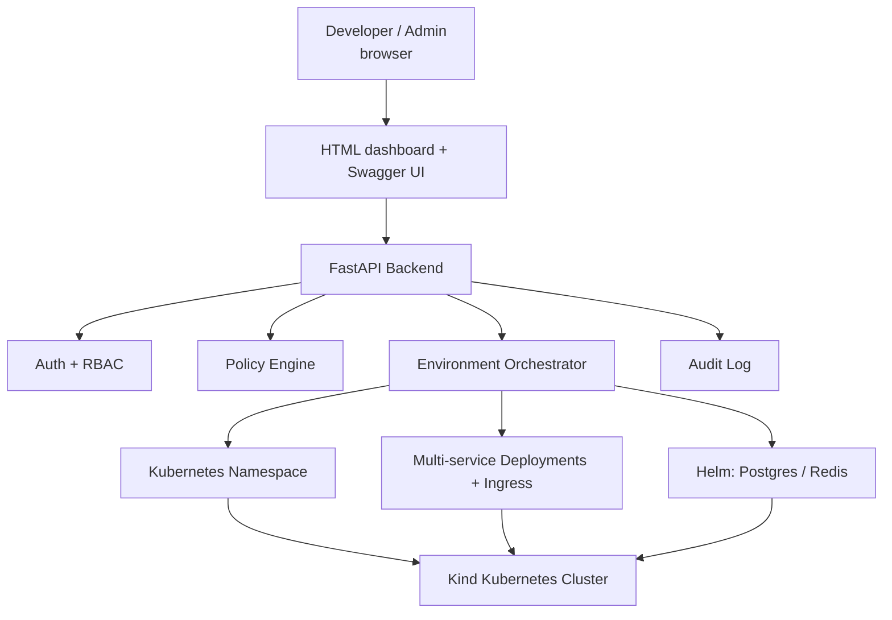

# CloudForge

**CloudForge** is an Internal Developer Platform (IDP) that automates the creation of isolated, self-service development environments on Kubernetes — inspired by platforms like Backstage and Humanitec used at large engineering orgs.

Instead of a developer filing a ticket and waiting on a DevOps team to manually provision infrastructure, CloudForge exposes a self-service dashboard where developers request environments directly. Low-risk requests are auto-approved instantly; higher-risk requests (databases, long-lived environments, multi-service apps) route to an admin for approval — giving developers speed without removing human oversight where it matters.

## Problem It Solves

Traditional workflow:

Developer -> Needs namespace, DB, cache, ingress -> Files a ticket -> Waits on DevOps


CloudForge workflow:

Developer -> Requests environment -> Auto-approved (low risk) or queued for admin (high risk) -> Live environment with a real URL


## Features

- **Self-service environment provisioning** — namespace, multi-service app deployments, optional PostgreSQL and Redis, all from one request
- **Multi-service environments** — a single environment can contain several independently deployed services (e.g. frontend + backend + worker), each with its own image, port, and URL, all networked together automatically via Kubernetes' built-in service discovery
- **Registry & config flexibility** — deploy from any public registry (Docker Hub, GHCR, GCR, etc.) or a private registry with per-service credentials; inject custom environment variables into any service
- **Auto-wired databases** — services in an environment with Postgres/Redis enabled automatically receive `DATABASE_URL`/`REDIS_URL` and related connection env vars — no manual wiring needed
- **Policy-based auto-approval** — low-risk requests (short TTL, single service, no database) are provisioned instantly; requests involving databases, long TTLs, or multiple services require admin approval before any Kubernetes resources are created
- **Role-Based Access Control (RBAC)** — Admin / Developer / Viewer roles enforced at both the route level and the resource level
- **User lifecycle management** — admins can deactivate/reactivate accounts and promote developers to admin; deactivated users are blocked at login
- **Full audit trail** — every sensitive action (requests, approvals, rejections, deletions, user changes) is logged with actor, target, and timestamp
- **Automated teardown** — a background scheduler deletes expired environments every 5 minutes; admins can also trigger teardown on demand
- **Web dashboard** — a plain HTML/Jinja2 UI for both developers (request/view/delete their own environments) and admins (approve/reject requests, manage all environments, manage users, view audit log)
- **Fully local** — runs entirely on a laptop using Kind (Kubernetes-in-Docker), no cloud account required

## Architecture


## Tech Stack

| Layer | Technology |
|---|---|
| API Framework | FastAPI (Python) |
| Web UI | Jinja2 templates, server-rendered HTML, cookie-based sessions |
| Auth | JWT (python-jose), bcrypt password hashing |
| Database (metadata) | PostgreSQL + SQLAlchemy ORM |
| Container Orchestration | Kubernetes (Kind — local cluster) |
| Kubernetes Client | Official `kubernetes` Python client |
| Package Manager (in-cluster) | Helm (Bitnami charts for Postgres/Redis) |
| Ingress | Nginx Ingress Controller |
| Scheduling | APScheduler (background teardown jobs) |
| API Docs | Swagger UI (auto-generated by FastAPI) |

## Core Concepts

### Environments
An environment is a full isolated workspace, not just a database:
- A Kubernetes **namespace** for isolation
- One or more **services** (e.g. frontend, backend, worker), each independently deployed with its own image and port
- **Ingress** routes giving each exposed service a reachable URL
- Optional **PostgreSQL** and/or **Redis**, shared across all services in the environment

### Approval Policy
| Condition | Result |
|---|---|
| No database, ≤2 services, TTL ≤8 hours | Auto-approved instantly |
| Postgres or Redis requested | Requires admin approval |
| TTL > 8 hours | Requires admin approval |
| More than 2 services | Requires admin approval |

Nothing is provisioned in Kubernetes for a `pending` request — namespace/pod/Helm creation only happens at approval time (or immediately, for auto-approved requests).

### RBAC
| Role | Request Env | Approve/Reject | Delete Own | Delete Any | Manage Users |
|---|---|---|---|---|---|
| Admin | Yes | Yes | Yes | Yes | Yes |
| Developer | Yes | No | Yes | No | No |
| Viewer | No | No | No | No | No |

### Teardown Automation
Every environment has a TTL set at creation. A background job runs every 5 minutes, deletes expired environments (cascading deletion of every service, Postgres, and Redis inside that namespace), and logs the action under a `system-scheduler` actor in the audit trail — distinct from human-triggered deletions.

## Web Dashboard Pages

| Page | Access | What it does |
|---|---|---|
| `/login`, `/register` | Public | Account creation and login (self-registration is developer-only) |
| `/dashboard` | Developer | Request new environments, view own environments and live URLs, delete own environments |
| `/admin` | Admin | Approve/reject pending requests, view/delete any environment, manage users (deactivate/reactivate/promote), manual teardown trigger, audit log viewer |

## API Endpoints (also available via Swagger UI at `/docs`)

| Method | Endpoint | Access | Description |
|---|---|---|---|
| POST | /auth/register | Public | Create a developer account |
| POST | /auth/login | Public | Get a JWT access token |
| POST | /environments/ | Admin, Developer | Request a new environment (auto-approved or pending) |
| GET | /environments/ | Any authenticated user | List environments (filtered by role) |
| GET | /environments/pending | Admin | List requests awaiting approval |
| POST | /environments/{name}/approve | Admin | Approve a pending request (triggers provisioning) |
| POST | /environments/{name}/reject | Admin | Reject a pending request |
| GET | /environments/{name} | Any authenticated user | Get environment status |
| DELETE | /environments/{name} | Admin, Developer | Delete an environment |
| GET | /admin/users | Admin | List all users |
| POST | /admin/users/{username}/deactivate | Admin | Disable a user's access |
| POST | /admin/users/{username}/reactivate | Admin | Restore a user's access |
| GET | /admin/audit-logs | Admin | View the audit trail |
| POST | /admin/teardown/run | Admin | Manually trigger expired-environment cleanup |

## Running Locally (WSL / Linux)

```bash
# 1. Start local Postgres (metadata DB)
docker run -d --name cloudforge-db \
  -e POSTGRES_USER=cloudforge -e POSTGRES_PASSWORD=cloudforge \
  -e POSTGRES_DB=cloudforge -p 5432:5432 postgres:16

# 2. Create Kind cluster + install Nginx Ingress
kind create cluster --name cloudforge --config kind-config.yaml
kubectl apply -f https://raw.githubusercontent.com/kubernetes/ingress-nginx/main/deploy/static/provider/kind/deploy.yaml

# 3. Install Python dependencies
python3.11 -m venv venv
source venv/bin/activate
pip install -r requirements.txt

# 4. Run the API + web dashboard
uvicorn app.main:app --reload --host 0.0.0.0 --port 8000

# 5. Open the dashboard
# http://localhost:8000/         -> redirects to login
# http://localhost:8000/docs     -> Swagger UI
```

## Example Usage (via UI)

1. Register a developer account at `/register`
2. Log in — lands on `/dashboard`
3. Request an environment (name, image, port, optional Postgres/Redis, TTL)
4. If low-risk: environment is live within seconds, with a clickable URL
5. If it needed approval: an admin logs in, sees it under **Pending Approvals** on `/admin`, and clicks Approve or Reject
6. Environment auto-deletes when its TTL expires, or can be deleted manually

## Roadmap

- [ ] Auto-inject `DATABASE_URL`/`REDIS_URL` into deployed services
- [ ] Alembic migrations for schema versioning
- [ ] Deploy-from-Git-repo (build image from a Dockerfile in the developer's repo)
- [ ] GitOps-based reconciliation (ArgoCD/Flux) instead of imperative Helm calls
- [ ] Resource quotas per team (CPU/memory/environment count)
- [ ] Multi-cluster support
